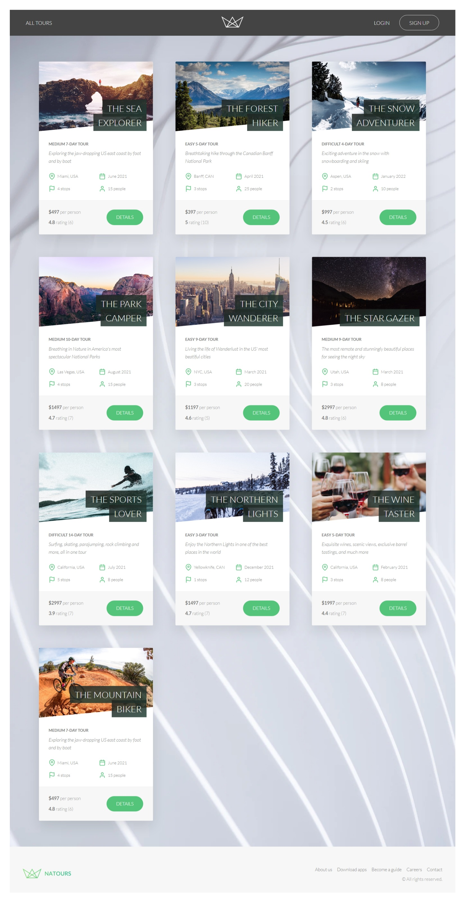
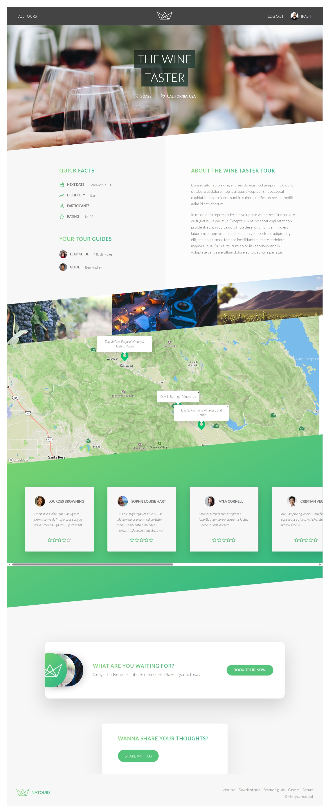
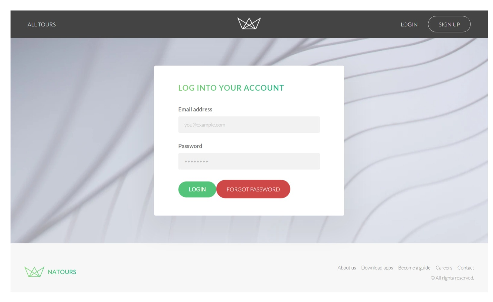
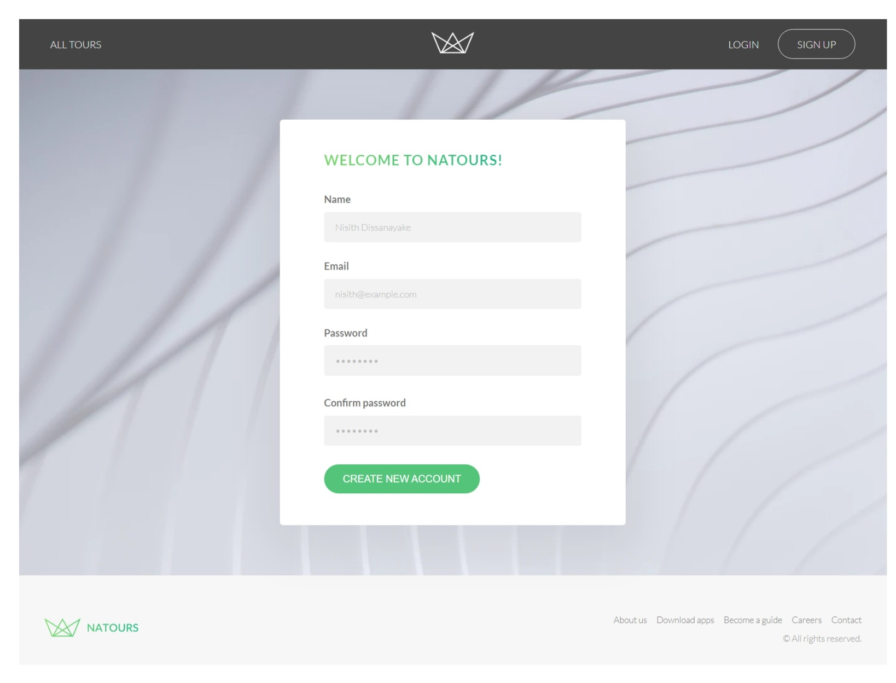
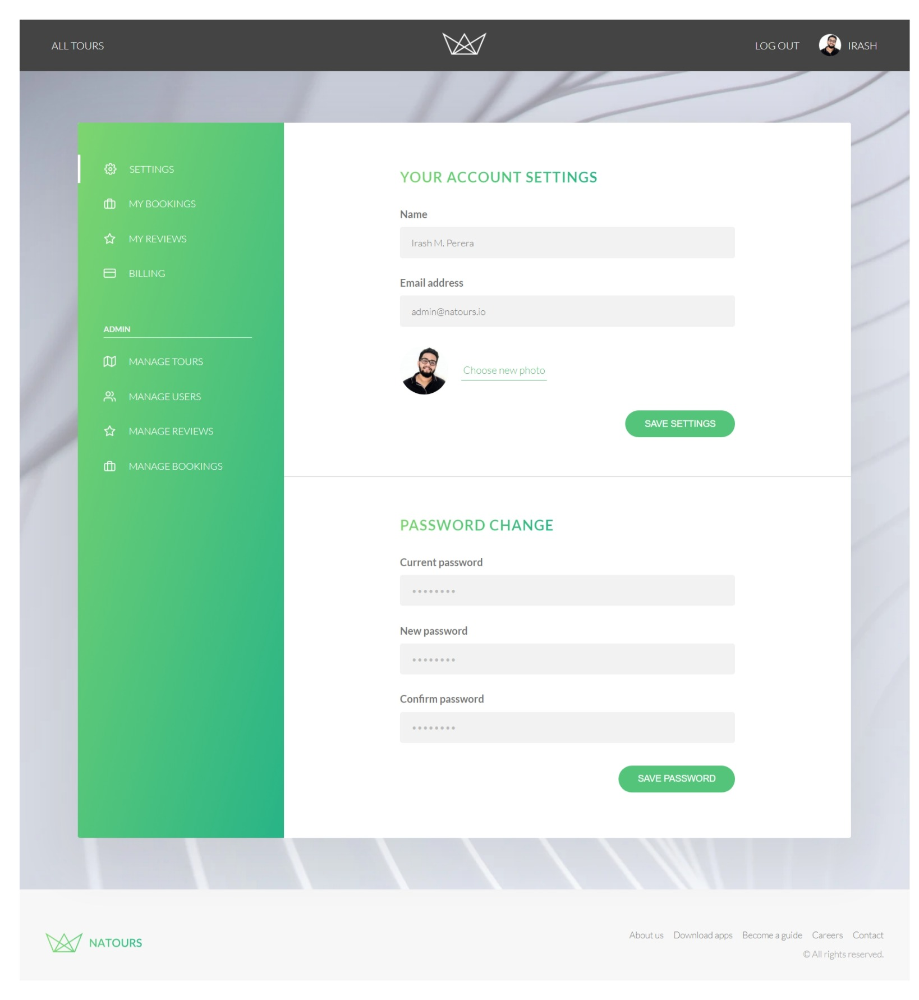
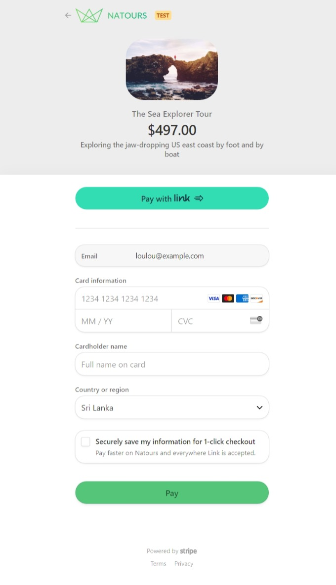
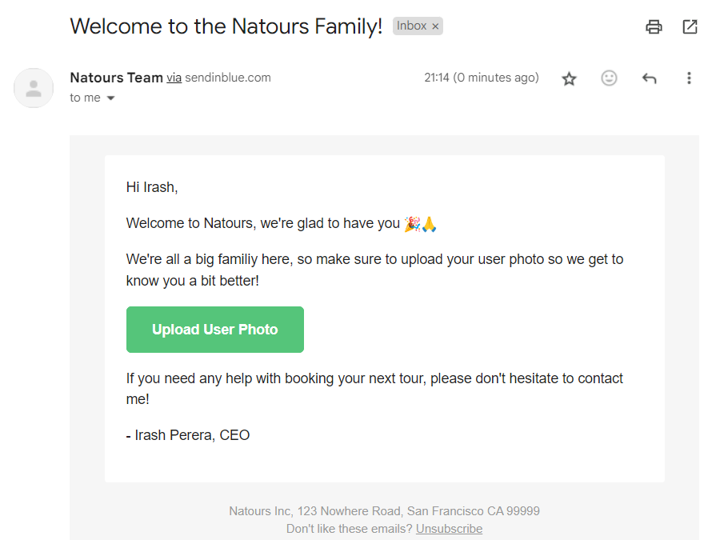
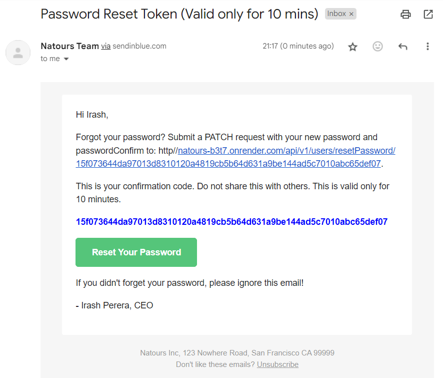

# Natours Application

Welcome to Natours API Backend, a powerful system designed to manage and streamline tour operations for commercial tour organizing companies. This RESTful API provides robust functionality to handle various aspects of tour management, from creating, editing, and deleting tours to managing bookings and user authentication.

### Key Features:

**Tour Management**: Create, update, and delete tour information, including details on destinations, schedules, pricing, and more.

**Booking System**: Handle tour reservations, manage availability, and process bookings securely.

**User Authentication**: Secure user registration and authentication mechanisms for both customers and administrators.

**Permissions and Roles**: Implement roles and permissions to control access levels and functionalities within the system.

**Data Integrity**: Ensure data integrity and consistency through comprehensive validation and error handling.

### Technologies Used:

**Node.js**: Powerful JavaScript runtime for building scalable and efficient backend applications.

**Express**: Fast and minimalist web framework for Node.js, simplifying API development.

**MongoDB**: NoSQL database for storing tour, user, and booking information with flexibility and scalability.

**JWT**: Implementation of JSON Web Tokens for secure and stateless authentication.

**Mongoose**: Elegant MongoDB object modeling for Node.js applications.

### Screenshots

| Page                   | Screenshot                                  |
|------------------------|---------------------------------------------|
| Tour Overview Page     |              |
| Tour Details Page      |              |
| Login Page             |                           |
| Sign Up Page           |                 |
| User Profile Page      |           |
| Booking Page           |                |
| Welcome Mail           |                  |
| Password Reset Mail    |  |

